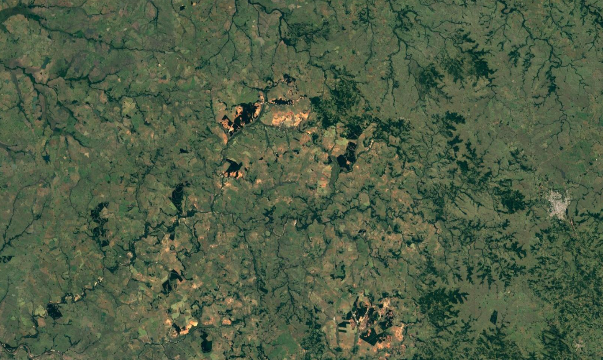

# Desertificação

# 🏜 Sobre a atividade
Essa atividade foi realizada na Disciplina de Processamento de imagens, onde foi proposto realizar a indentificação de áreas desertas na região do pampa utilizando a seguinte imagem de satélite:

